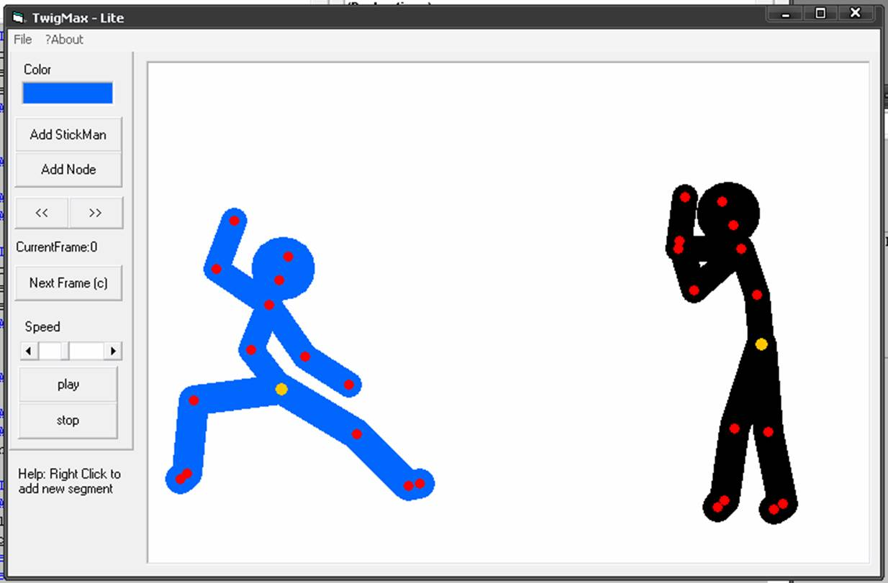



## TwigMax \- Lite Stickfigure Animator

### Description

This program is similar to popular Pivot StickFigure Animator. So, if anyone want's to create another stickfigure animator, this is helpful for starting.
 
### More Info
 

             |
---                |---
**Submitted On**   |2011-02-21 02:55:50
**By**             |[Glenn Michael Mejias](https://github.com/Planet-Source-Code/PSCIndex/blob/master/ByAuthor/glenn-michael-mejias.md)
**Level**          |Beginner
**User Rating**    |5.0 (20 globes from 4 users)
**Compatibility**  |VB 6\.0
**Category**       |[Complete Applications](https://github.com/Planet-Source-Code/PSCIndex/blob/master/ByCategory/complete-applications__1-27.md)
**World**          |[Visual Basic](https://github.com/Planet-Source-Code/PSCIndex/blob/master/ByWorld/visual-basic.md)
**Archive File**   |[TwigMax\_\-\_2220392212012\.zip](https://github.com/Planet-Source-Code/glenn-michael-mejias-twigmax-lite-stickfigure-animator__1-74277/archive/master.zip)

